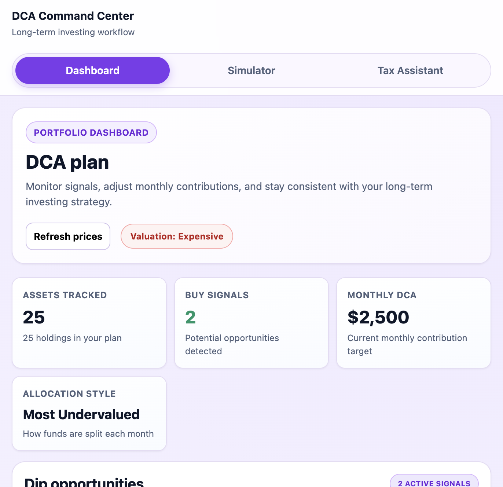
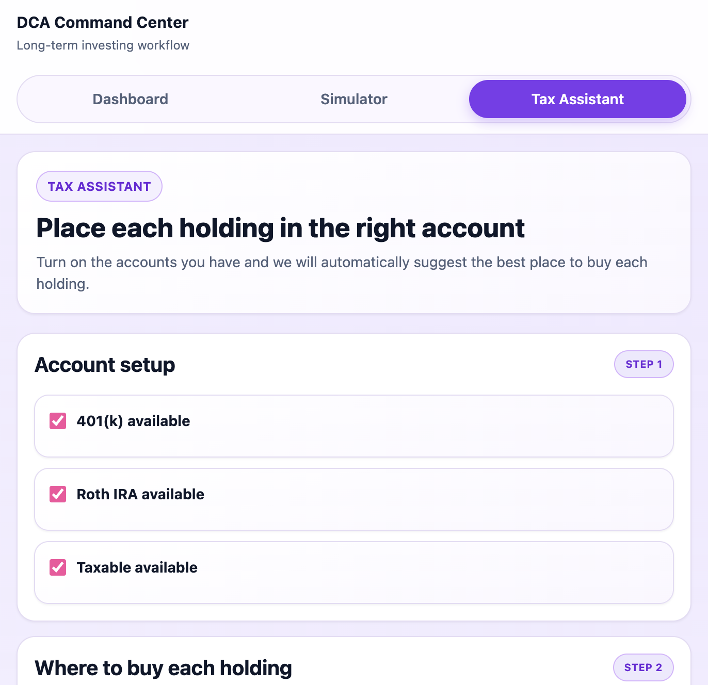
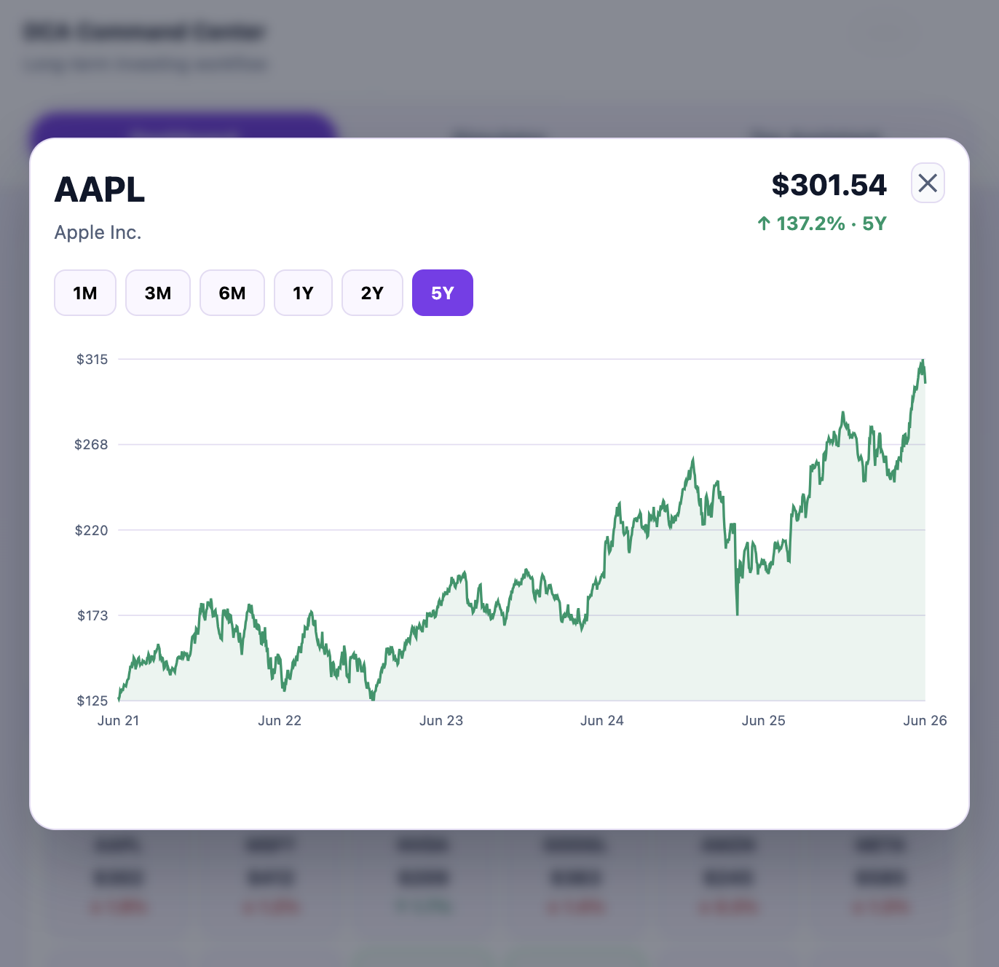
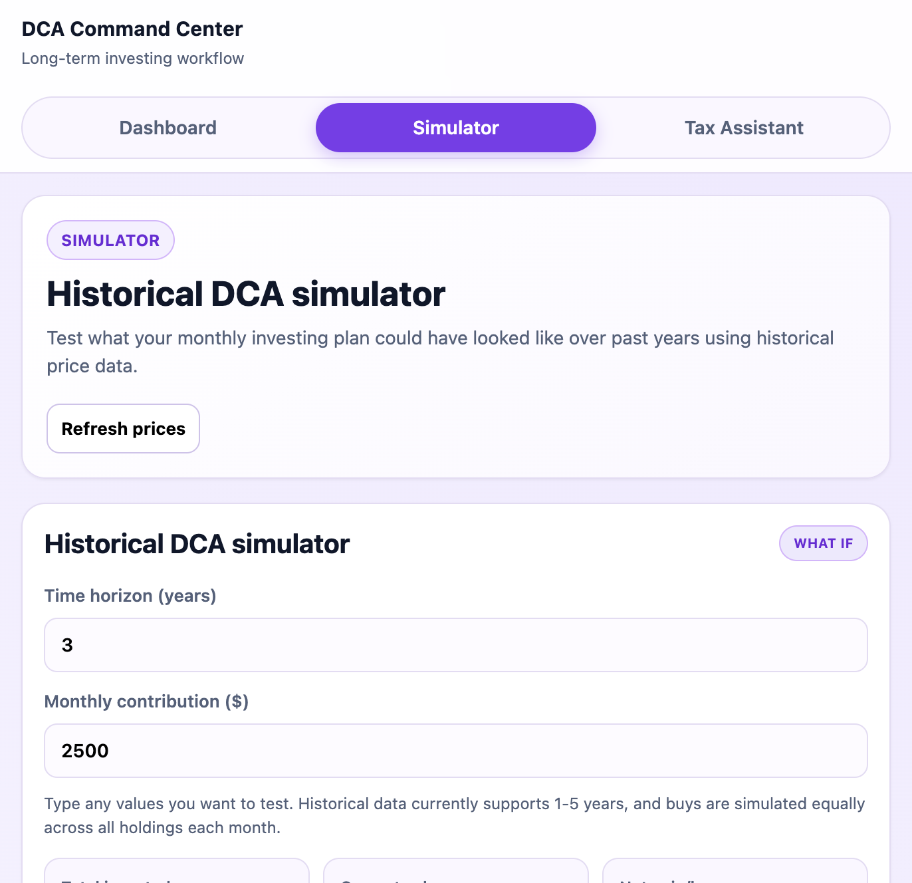

# DCA Investment Dashboard

A stock dashboard optimized for **long-term investing and dollar-cost averaging (DCA)**. It tracks a portfolio of stocks and index funds, pulls live data from Yahoo Finance, and surfaces *unusual dips* worth buying — so you can deploy your monthly contributions where they get the most value.

Built for a 10–20 year time horizon: it does not chase day-trades. It highlights when holdings fall meaningfully below their historical trend, then helps you decide how to allocate that month's cash.

---

## Features

- **25 default holdings** — 10 large-cap tech stocks + 15 index funds/ETFs (fully editable).
- **Buy-signal detection** — flags holdings that are:
  - trading >15% below their 200-day moving average,
  - near their 52-week low, or
  - down sharply (high volatility / possible overreaction).
- **Two allocation strategies** — concentrate on the most undervalued positions, or spread evenly.
- **Adjustable monthly contribution** — model any DCA amount.
- **Add / remove holdings** — portfolio persists in the browser (localStorage).
- **Live Yahoo Finance data** — via a small backend proxy (see Architecture).

---

## Screenshots

Add your screenshots under `assets/screenshots/` in this repository:

```text
assets/
└── screenshots/
    ├── dashboard.png
    ├── stock-chart.png
    ├── tax-assistant.png
    └── historical-simulator.png
```

### Dashboard



### Tax Assistant



### Stock Chart Modal



### Historical Simulator



---

## Architecture

```
Browser (React + Vite)
        │  GET /api/quotes?symbols=AAPL,MSFT,...
        ▼
Express backend (Node)  ──uses──►  yahoo-finance2  ──►  Yahoo Finance
        │
        ▼
   clean JSON back to the browser
```

**Why a backend?** Yahoo provides no official API, and the `yahoo-finance2`
library [cannot run in the browser](https://github.com/gadicc/yahoo-finance2)
due to CORS and cookie restrictions. All Yahoo calls happen server-side; the
React app only ever talks to our own `/api` endpoints.

In development, Vite's dev server proxies `/api` to the Express server on port
3001 (configured in `vite.config.js`), so there are no CORS issues locally.

### Project structure

```
dca-dashboard/
├── index.html              # Vite HTML entry
├── vite.config.js          # Vite + dev proxy config
├── package.json            # Scripts + dependencies
├── server/
│   └── index.js            # Express proxy: /api/quotes, /api/history
└── src/
    ├── main.jsx            # React entry
    ├── App.jsx             # Top-level composition + shared state
    ├── index.css           # Styles
    ├── api/
    │   └── stocks.js       # fetch() wrappers for the backend
    ├── hooks/
    │   ├── usePortfolio.js # Portfolio state + localStorage
    │   └── useQuotes.js    # Quote fetching + loading/error state
    ├── utils/
    │   ├── signals.js      # Buy-signal logic (pure functions)
    │   ├── allocation.js   # Allocation strategies (pure functions)
    │   └── constants.js    # Default portfolio
    └── components/
        ├── MetricGrid.jsx
        ├── ContributionSettings.jsx
        ├── AllocationRecommendations.jsx
        ├── DipOpportunities.jsx
        └── HoldingsGrid.jsx
```

---

## Getting started

**Prerequisites:** Node.js 20+ (the `yahoo-finance2` library supports current/active LTS versions).

```bash
# 1. Install dependencies
npm install

# 2. Run frontend + backend together
npm run dev
```

Then open the URL Vite prints (default http://localhost:5173).

`npm run dev` starts both processes via `concurrently`:
- the Express API on http://localhost:3001
- the Vite dev server on http://localhost:5173

You can also run them separately with `npm run dev:server` and `npm run dev:client`.

### Production build

```bash
npm run build      # builds the frontend into dist/
npm start          # runs the Express API
```

To serve the built frontend from Express in production, add a static handler
to `server/index.js` pointing at `dist/` (left as a deliberate next step so you
can choose your own hosting setup — e.g. serving statically, or deploying the
API as a serverless function).

---

## How the buy signals work

All logic lives in `src/utils/signals.js` as pure functions, so it's easy to
tweak the thresholds or add your own rules. The defaults reflect a conservative,
long-horizon "buy the dip" approach rather than active trading:

| Signal | Trigger | Rationale |
|--------|---------|-----------|
| Below 200-day MA | price < 200-day MA × 0.85 | Deep discount vs. long-term trend |
| Near 52-week low | price < 52-week low × 1.05 | Significant undervaluation |
| High volatility | down >15% | Possible market overreaction |

Edit those thresholds in `getBuySignals()` to match your own risk tolerance.

---

## Customization ideas

- **Historical charts** — `/api/history` is already wired up; add a chart
  component (e.g. with Chart.js) that calls `fetchHistory(symbol, '1y')`.
- **Price alerts** — store target prices per symbol alongside the portfolio.
- **Auto-refresh** — add an interval in `useQuotes` to poll periodically.
- **More signals** — RSI, MACD, or distance-from-all-time-high in `signals.js`.

---

## Disclaimer

This tool is for informational and educational purposes only. It is not
financial advice. Data is sourced from an unofficial Yahoo Finance library that
makes no guarantees of accuracy or availability. Always do your own research
before investing.

## License

MIT
